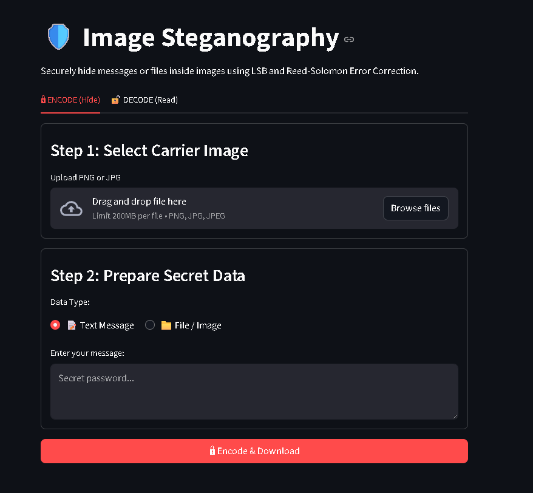
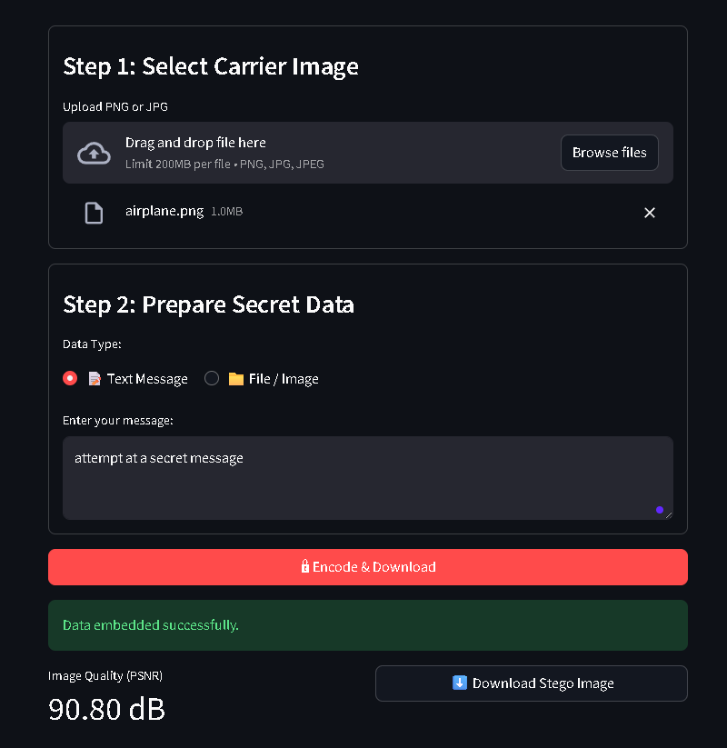
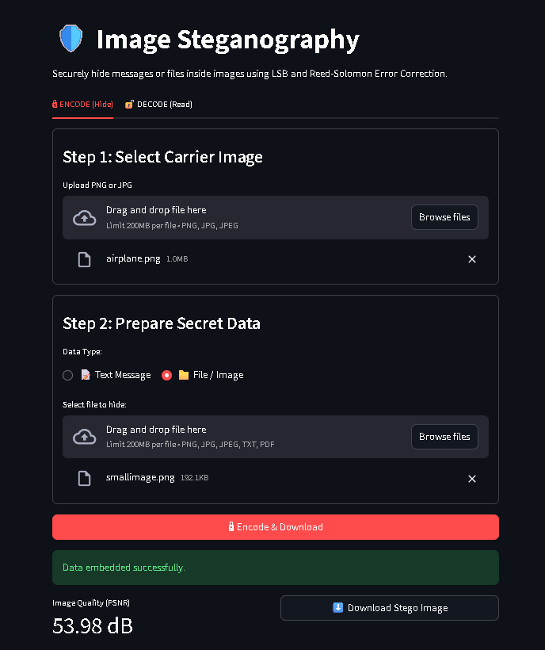
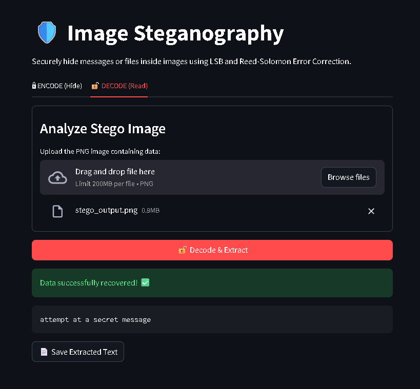
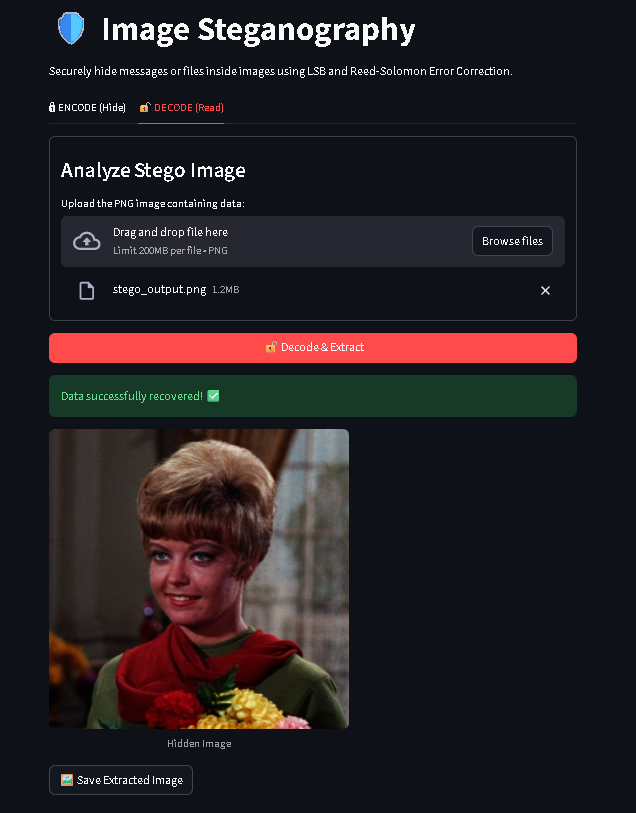

# 🛡️ Image Steganography Tool

A high-performance, secure image steganography application built with **Python** and **Streamlit**. This tool enables users to hide secret messages or entire files (images, PDFs, etc.) inside carrier images using **Least Significant Bit (LSB)** encoding combined with **Reed-Solomon Error Correction**.

---

## ✨ Features

- **🔒 Secure Encoding:** Hides data within the LSB of image pixels, making the changes nearly invisible to the human eye.
- **🛠️ Error Correction:** Integrated **Reed-Solomon (ECC)** ensures that hidden data can be recovered even if the image undergoes minor pixel alterations.
- **📊 Quality Metrics:** Real-time **PSNR (Peak Signal-to-Noise Ratio)** calculation to monitor image degradation.
- **📁 File Agnostic:** Supports hiding plain text, secret images (PNG/JPG), and binary files like PDFs.
- **🌈 Alpha Channel Support:** Full compatibility with RGBA images, ensuring transparency is preserved during the process.

---

## 📸 App Screenshots







## 🚀 Installation & Usage

### 1. Clone the Repository

```bash
git clone [https://github.com/lesedir0/image-steganography-tool.git](https://github.com/lesedir0/image-steganography-tool.git)
cd pro-steganography-tool

### 2.Install Requirements
pip install -r requirements.txt

### 3. Run the App
streamlit run app.py

🛠️ Technical Implementation
LSB (Least Significant Bit): The core algorithm modifies the last bit of each color channel (R, G, B) to store binary data.
Reed-Solomon: Adds redundancy to the secret data, allowing the decoder to fix errors if the stego-image is slightly corrupted.
PSNR Calculation: Uses the following formula to measure visual quality:$$PSNR = 20 \cdot \log_{10}\left(\frac{255}{\sqrt{MSE}}\right)$$Where $MSE$ (Mean Squared Error) is the difference between the original and stego image.
```
